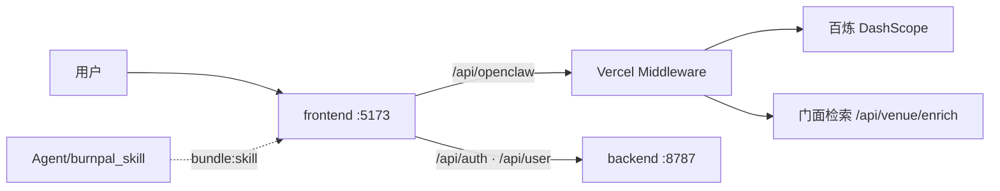

<h1 align="center">QingLu 轻鹭</h1>

<p align="center">
  <strong>AI 本地生活减脂管家 · 美团黑客松</strong>
</p>

<p align="center">
  <a href="https://github.com/ShuoMeng66/QingLu"></a>
  
  
  
  
  
  
  
</p>

<p align="center">
  <a href="#-概览">概览</a> ·
  <a href="#-核心特性">特性</a> ·
  <a href="#-技术栈">技术栈</a> ·
  <a href="#-产品旅程demo">Demo</a> ·
  <a href="#-快速开始">快速开始</a> ·
  <a href="#-部署到-vercel">部署</a> ·
  <a href="#-项目结构">结构</a> ·
  <a href="#-仓库统计">统计</a>
</p>

---

> **轻鹭相伴，生活更轻盈。**
>
> 把 OpenClaw Skill 与百炼大模型接到真实生活场景——外卖、聚餐、训练、恢复与一起动——让 AI 成为你的本地生活减脂管家。

> [!IMPORTANT]
> 产品品牌为 **QingLu（轻鹭）**（原 BurnPal）。代码仓库：[`ShuoMeng66/QingLu`](https://github.com/ShuoMeng66/QingLu)。

## 📖 概览

QingLu 是一套 **React + Vite 前端** + **Express 账户后端** + **OpenClaw / 百炼 AI** 的全栈 Demo。Skill 包在构建时打入 system prompt，主对话经 Edge Middleware 代理百炼 API，门面检索与输出守门与主链路分离，适合黑客松演示与二次集成。



## ✨ 核心特性

| 模块 | 说明 |
|------|------|
| **今日管家首页** | 今日状态条 → 轻鹭发现卡 → 五类生活任务（外卖 / 聚餐 / 去哪练 / 恢复 / 一起动） |
| **Demo  onboarding** | 小明 / 小红 / 王总档案，一键进入 `/ready` 档案反馈与 `/chat` 对话 |
| **OpenClaw Skill** | 四模块 Skill（吃什么 / 去哪练 / 恢复放松 / 一起动）+ 北京 / 上海场景数据 |
| **本地生活卡片** | AI 回复 + 门店卡片，「去看看」承接美团 / 点评（Demo 无真实链接时弹窗说明） |
| **输出守门** | 展示前质检：异地门店、Markdown 格式等（`deepseek-v4-flash`，可在设置关闭） |
| **门面检索** | 匹配 Skill 店名后异步拉门头图（`POST /api/venue/enrich`） |
| **账户与云同步** | Express + SQLite 后端，邮箱验证码（Resend），Vercel 代理转发 |

## 🛠 技术栈

<p align="center">
  
</p>

| 层级 | 技术 |
|------|------|
| 前端 | React 19 · Vite · Tailwind CSS 4 · React Router · Framer Motion · Leaflet |
| 后端 | Express · SQLite · JWT · Resend |
| AI | 百炼 OpenClaw 兼容 API · DeepSeek V4 · Qwen 门面检索 |
| 部署 | Vercel（前端 + Edge Middleware）· Render / Railway 等（账户 API） |

## 🧭 产品旅程（Demo）

1. 首页「唤醒我的轻鹭管家」→ `/onboard` 选择 Demo 档案（小明 / 小红 / 王总）
2. `/ready` 展示今日减脂生活档案反馈卡
3. `/chat` 今日管家首页：今日状态条 → 轻鹭发现卡 → 五类生活任务
4. 点击任务自动发送场景化 prompt，AI 回复 + 本地生活卡片

## 🚀 快速开始

### Windows（推荐）

双击或在 PowerShell 中运行：

```powershell
.\scripts\start.ps1
```

或：

```powershell
.\scripts\start.bat
```

脚本会自动：安装 `backend` / `frontend` 依赖、从 `frontend\.env.example` 生成 `frontend\.env.local`、启动后端 `8787` 与前端 `5173`，并打开 http://127.0.0.1:5173

### 手动启动

```powershell
# 终端 1 — 账户 API
cd backend
npm install
npm run dev

# 终端 2 — 前端 + OpenClaw 代理
cd frontend
npm install
copy .env.example .env.local
# 编辑 .env.local，填入 VITE_OPENCLAW_TOKEN（百炼 API Key）
npm run dev
```

### OpenClaw / 百炼配置

`frontend/.env.local`：

```env
VITE_OPENCLAW_BASE_URL=/openclaw-api/v1
VITE_OPENCLAW_PROXY_TARGET=https://dashscope.aliyuncs.com
VITE_OPENCLAW_PROXY_PATH=/compatible-mode
VITE_OPENCLAW_TOKEN=你的百炼API_Key
VITE_OPENCLAW_AGENT=qwen-plus
```

本地开发时，Vite 将 `/openclaw-api` 代理到百炼，避免浏览器 CORS。

> [!TIP]
> 根目录也可使用 `npm run install:all` 与 `npm run dev` 并行启动前后端（见根 `package.json`）。

---

## ☁️ 部署到 Vercel

### 1. 推送到 GitHub

```bash
git remote add origin git@github.com:ShuoMeng66/QingLu.git
# 若在 GitHub 将仓库改名为 QingLu 后：
# git remote set-url origin git@github.com:ShuoMeng66/QingLu.git
git push -u origin main
```

### 2. 在 Vercel 导入仓库

1. 打开 [vercel.com/new](https://vercel.com/new) → Import 本仓库 `ShuoMeng66/QingLu`
2. **Framework Preset**: Other（已配置 `vercel.json`）
3. 无需改 Build 命令（根目录 `vercel.json` 已指定 `frontend` 构建）

### 3. 环境变量（Vercel Project → Settings → Environment Variables）

| 变量 | 说明 | 示例 |
|------|------|------|
| `OPENCLAW_TOKEN` | 百炼 API Key（**服务端**代理注入，必填） | `sk-xxx` |
| `OPENCLAW_PROXY_TARGET` | 可选，服务端上游 | `https://dashscope.aliyuncs.com` |
| `OPENCLAW_PROXY_PATH` | 可选，服务端路径前缀 | `/compatible-mode` |
| `VITE_OPENCLAW_BASE_URL` | **构建时**写入前端，需 redeploy | `/api/openclaw/v1`（推荐；勿用 `/openclaw-api`） |
| `VITE_OPENCLAW_AGENT` | **构建时**默认模型，需 redeploy | `deepseek-v4-flash` 或 `deepseek-v4-pro` |
| `VENUE_ENRICH_MODEL` | 可选，门面检索子调用模型 | `qwen3.5-omni-plus-2026-03-15` |
| `VENUE_ENRICH_ENABLED` | 可选，设为 `false` 关闭门面检索 | 默认开启 |
| `VITE_GUARD_AGENT` | 可选，输出守门模型 | `deepseek-v4-flash` |
| `BACKEND_URL` | 已部署的后端公网地址（账户/云同步） | `https://your-api.onrender.com` |
| `RESEND_API_KEY` | 验证码发信（可只配在 Vercel，见下） | `re_…` |
| `BURNPAL_PROXY_SECRET` | Vercel→Render 转发 Resend 密钥时的共享口令 | 与 Render 相同 |

**多模型分工**：

| 阶段 | 模型 | 说明 |
|------|------|------|
| 主对话 | `deepseek-v4-pro`（或 `VITE_OPENCLAW_AGENT`） | 流式生成，草稿先缓冲不展示 |
| 输出守门 | `deepseek-v4-flash`（`VITE_GUARD_AGENT`） | 展示前质检；设置 → AI 偏好 →「输出前质检」 |
| 门面检索 | `qwen3.5-omni-plus-2026-03-15`（`VENUE_ENRICH_MODEL`） | 匹配 Skill 店名后异步拉门头图 |

> [!WARNING]
> 勿在生产设置 `VITE_OPENCLAW_TOKEN`（会打进前端 bundle）。`VITE_OPENCLAW_PROXY_*` 仅本地 Vite 开发代理用，Vercel 上请用 `OPENCLAW_PROXY_*`。API Key 不要写进前端 bundle。

生产环境 **Edge Middleware** 代理：

- OpenClaw：`/api/openclaw`、`/openclaw-api`（`OPENCLAW_TOKEN` 仅服务端）
- **Venue Scout（门面检索）**：`POST /api/venue/enrich`
- 账户 API：`/api/auth`、`/api/user`（转发到 `BACKEND_URL`）

**Vercel 上的 Skill**：构建时 `frontend` 会把 `Agent/burnpal_skill/` 全量打包进聊天 **system prompt**（约 150KB）。只需 push GitHub 并 Redeploy；`VITE_OPENCLAW_AGENT` 建议 `deepseek-v4-pro` 或 `deepseek-v4-flash`。

### 部署后自检（OpenClaw）

在 Vercel **Redeploy** 最新 `main` 后，浏览器打开：

| URL | 期望 |
|-----|------|
| `https://你的域名/api/openclaw/health` | JSON：`ok: true`，`runtime: edge-middleware`，`hasToken: true` |
| `https://你的域名/api/openclaw/v1/models` | JSON：`data` 模型列表（200） |
| `https://你的域名/openclaw-api/v1/models` | 同上（兼容别名） |

若返回整页 HTML 或 404，说明路由/部署未更新；若 `hasToken: false`，说明 `OPENCLAW_TOKEN` 未注入当前 Production 部署。

若设置页报 **502 `fetch failed`**：多半是 `OPENCLAW_PROXY_TARGET` 误填了本地地址。请设为 `https://dashscope.aliyuncs.com` + `OPENCLAW_PROXY_PATH=/compatible-mode`，`OPENCLAW_TOKEN` 填**百炼**控制台 API Key，然后 Redeploy。

**百炼免费 DeepSeek V4**：模型 ID 用 `deepseek-v4-flash` 或 `deepseek-v4-pro`（见[百炼 DeepSeek 文档](https://help.aliyun.com/zh/model-studio/deepseek-api)）。不要填 `api.deepseek.com` 作为代理地址。

账户 API 自检（需已设置 `BACKEND_URL` 并完成 Redeploy）：

| URL | 期望 |
|-----|------|
| `https://你的域名/api/auth/health` | JSON：`emailReachable: true` |
| `POST /api/auth/send-verification-code` | JSON：`{"ok":true,"smtp":true}`（未注册邮箱） |

**登录一直「处理中…」**：多半是 `BACKEND_URL` 未设置、Render 冷启动或代理超时。打开 `https://你的域名/api/auth/health` 应返回 JSON（不是 HTML 404）。登录请求约 22s 后会提示超时；Splash 页会自动 ping health 以预热后端。

### 4. 账户后端（云同步 / 注册）

SQLite 后端不适合 Vercel Serverless 持久化，请单独部署 `backend/` 到 Render、Railway、Fly.io 等，然后在 Vercel 设置 `BACKEND_URL`。

Render 示例：

- Root: `backend`
- Build: `npm install && npm run build`
- Start: `npm start`
- 环境变量：`JWT_SECRET`、**`RESEND_API_KEY`**、**`BURNPAL_PROXY_SECRET`**（见 `backend/.env.example`）
- **Resend 可只配在 Vercel**：在 Vercel 与 Render 填相同的 `BURNPAL_PROXY_SECRET`，Middleware 会把 `RESEND_API_KEY` 安全转给 Render 发信

---

## 📁 项目结构

```
QingLu/
├── frontend/          # Vite + React 前端（qinglu 组件、今日管家、输出守门）
├── backend/           # Express + SQLite 账户与云同步
├── Agent/
│   ├── burnpal_skill/ # OpenClaw Skill 包（vendor 路径名保留；产品名 QingLu）
│   ├── _legacy/       # 早期 hackathod_skill（Heartbeat 脚本等）
│   └── trace2skill/   # 对话轨迹 → Skill 进化
├── api/               # Vercel Serverless 代理（OpenClaw + 后端转发）
├── scripts/           # 一键启动脚本
└── vercel.json
```

相关文档：[`Agent/README.md`](Agent/README.md) · [`frontend/README.md`](frontend/README.md) · [`backend/README.md`](backend/README.md)

前端构建脚本：`npm run bundle:skill`（生成 `qingluSkillContext.ts`、`qingluVenues.generated.ts`、`demoProfiles.generated.ts`）

## 📊 仓库统计

<p align="center">
  <a href="https://github.com/ShuoMeng66/QingLu">
    
  </a>
  <a href="https://github.com/ShuoMeng66/QingLu">
    
  </a>
</p>

> [!NOTE]
> 统计卡片由 [github-readme-stats](https://github.com/anuraghazra/github-readme-stats) 公共实例生成，反映 GitHub 公开数据；若仓库改名或设为私有，卡片可能需更新 `username` / `repo` 参数或自行部署 stats 服务。

## 👥 团队与贡献

- **CiCiLYX（[@CCLYX](https://github.com/CCLYX)）**：OpenClaw Skill 体系与全套模拟数据（[burnpal.skill](https://github.com/CCLYX/burnpal.skill)）— 四模块 Skill、路由层、北京与上海场景数据。
- **ShuoMeng66**：前端应用、账户后端、Vercel/Render 部署与产品集成。

主仓库内 Skill 为 vendor 拷贝，路径为 [`Agent/burnpal_skill/`](Agent/burnpal_skill/)；上游见 [CCLYX/burnpal.skill](https://github.com/CCLYX/burnpal.skill)。

## 📄 License

Private — Hackathon project。当前仓库未提供独立的 `LICENSE` 文件；对外分发或开源前请先补充明确的许可证文本。

---

<p align="center">
  <sub>Built for 美团黑客松 · QingLu 轻鹭</sub>
</p>
