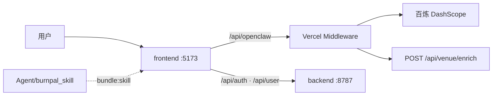

# QingLu 轻鹭

> AI 本地生活减脂管家：React 前端 + Express 账户后端 + 百炼 OpenClaw 对话，面向美团黑客松 Demo 与二次集成。

仓库：[ShuoMeng66/QingLu](https://github.com/ShuoMeng66/QingLu)

## 概览

QingLu 把 OpenClaw Skill 与百炼大模型接到外卖、聚餐、训练、恢复与一起动等生活场景。前端在构建时将 `Agent/burnpal_skill/` 按模块切分；**每次对话**由 `skillRouter` 判定意图后，仅把**路由层 + 一个 Skill 模块**注入 system prompt（方案 B，节省 token）。生产环境由 Vercel Edge Middleware 代理百炼 API，门面检索与输出守门与主链路分离。



## 功能特性

- **今日管家首页**：今日状态条、轻鹭发现卡、五类生活任务（外卖 / 聚餐 / 去哪练 / 恢复 / 一起动）
- **Demo 建档**：小明 / 小红 / 王总档案，`/onboard` → `/ready` → `/chat`
- **OpenClaw Skill**：四模块（吃什么 / 去哪练 / 恢复放松 / 一起动）+ 北京 / 上海场景数据
- **本地生活卡片**：AI 回复与门店卡片，「去看看」承接平台链接（Demo 无真实链接时弹窗说明）
- **输出守门**：展示前质检（默认 `deepseek-v4-flash`，可在设置关闭）
- **门面检索**：匹配 Skill 店名后异步拉门头图
- **账户与云同步**：邮箱验证码注册、JWT、SQLite 持久化，Vercel 转发至独立后端

## 技术栈

| 层级 | 技术 |
|------|------|
| 前端 | React 19、Vite 8、Tailwind CSS 4、React Router、Framer Motion、Leaflet |
| 后端 | Express 5、SQLite（better-sqlite3）、JWT、Resend / SMTP |
| AI | 百炼 OpenClaw 兼容 API、DeepSeek V4、Qwen 门面检索 |
| 部署 | Vercel（静态前端 + Edge Middleware + Serverless）、Render 等（账户 API） |
| 工具 | TypeScript、ESLint、npm |

## 项目结构

```text
QingLu/
├── frontend/              # Vite + React（qinglu 组件、今日管家、输出守门）
├── backend/               # Express 账户 API（:8787）
├── Agent/
│   ├── burnpal_skill/     # OpenClaw Skill（上游 CCLYX/burnpal.skill）
│   ├── _legacy/           # 早期 hackathod_skill
│   └── trace2skill/       # 对话轨迹 → Skill 进化
├── api/                   # Vercel：OpenClaw 代理、backend 转发、venue enrich
├── lib/                   # Edge 共享代理逻辑
├── scripts/               # 一键启动（start.ps1 / start.bat）
├── vercel.json
└── package.json           # 根脚本：install:all、dev、build
```

子文档：[`Agent/README.md`](Agent/README.md) · [`frontend/README.md`](frontend/README.md) · [`backend/README.md`](backend/README.md)

## 快速开始

### 环境要求

- Node.js 20+（建议 LTS）
- npm
- 百炼 DashScope API Key（本地对话）
- 可选：Resend API Key（注册验证码；Render 免费版建议 Resend，勿依赖 SMTP）

### 安装

**Windows（推荐）**

```powershell
.\scripts\start.ps1
```

或 `.\scripts\start.bat`。脚本会安装 `backend` / `frontend` 依赖、从 `frontend\.env.example` 生成 `.env.local`、启动 `:8787` 与 `:5173`，并打开 http://127.0.0.1:5173

**手动**

```powershell
npm run install:all
# 或分别 cd backend / frontend 执行 npm install
```

### 配置

**前端** — 复制 `frontend/.env.example` 为 `frontend/.env.local`：

```env
VITE_OPENCLAW_BASE_URL=/openclaw-api/v1
VITE_OPENCLAW_PROXY_TARGET=https://dashscope.aliyuncs.com
VITE_OPENCLAW_PROXY_PATH=/compatible-mode
VITE_OPENCLAW_TOKEN=你的百炼API_Key
VITE_OPENCLAW_AGENT=deepseek-v4-flash
VITE_GUARD_AGENT=deepseek-v4-flash
VITE_API_BASE_URL=/api
VITE_API_PROXY_TARGET=http://127.0.0.1:8787
```

**后端** — 复制 `backend/.env.example` 为 `backend/.env`，按需填写 `JWT_SECRET`、`RESEND_API_KEY`、`RESEND_FROM`、`QINGLU_PROXY_SECRET`（仅 Vercel 转发 Resend 时需要）。

### 运行

```powershell
# 根目录并行启动前后端
npm run dev

# 或分终端
cd backend && npm run dev
cd frontend && npm run dev
```

前端构建会先执行 `npm run bundle:skill`（生成 `qingluSkillModules.ts`、`qingluVenues.generated.ts`、`demoProfiles.generated.ts`）。

### 构建与检查

| 命令 | 位置 | 说明 |
|------|------|------|
| `npm run build` | 根目录 | 构建前端 |
| `npm run build` | `frontend/` | `bundle:skill` + `tsc` + `vite build` |
| `npm run build` | `backend/` | `tsc` 编译 |
| `npm run lint` | `frontend/` | ESLint |
| `npm run preview` | `frontend/` | 预览生产构建 |

## 产品旅程（Demo）

1. 首页「唤醒我的轻鹭管家」→ `/onboard` 选择 Demo 档案
2. `/ready` 档案反馈卡
3. `/chat` 今日管家：状态条、发现卡、五类任务
4. 点击任务自动发送场景化 prompt，展示 AI 回复与门店卡片

## API

生产环境经 Vercel 转发；本地开发时账户 API 默认由 Vite 代理到 `http://127.0.0.1:8787`。

### 账户后端（`backend/src`）

| Method | Path | 说明 |
|--------|------|------|
| GET | `/health` | 服务健康 |
| GET | `/api/auth/health` | 邮件 / Resend 可达性 |
| POST | `/api/auth/send-verification-code` | 发送注册验证码 |
| POST | `/api/auth/register` | 注册 |
| POST | `/api/auth/login` | 登录 |
| GET | `/api/auth/me` | 当前用户（Bearer） |
| PATCH | `/api/auth/profile` | 更新资料（Bearer） |
| POST | `/api/auth/change-password` | 修改密码（Bearer） |
| GET | `/api/user/data` | 读取云同步数据（Bearer） |
| PUT | `/api/user/data` | 写入云同步数据（Bearer） |

### Vercel Edge / Serverless（`api/`、`middleware`）

| Method | Path | 说明 |
|--------|------|------|
| GET | `/api/openclaw/health` | OpenClaw 代理健康检查 |
| * | `/api/openclaw/v1/*` | 百炼 OpenClaw 兼容 API（服务端注入 `OPENCLAW_TOKEN`） |
| * | `/openclaw-api/v1/*` | 同上（兼容别名） |
| POST | `/api/venue/enrich` | 门面检索（店名 → 门头图） |
| * | `/api/auth/*`、`/api/user/*` | 转发至 `BACKEND_URL` 指向的 Express |

## 部署

### Vercel（前端 + AI 代理）

1. [vercel.com/new](https://vercel.com/new) → Import [`ShuoMeng66/QingLu`](https://github.com/ShuoMeng66/QingLu)
2. Framework Preset：**Other**（根目录 `vercel.json` 已配置 `frontend` 构建）
3. 配置环境变量后 **Redeploy**

| 变量 | 说明 |
|------|------|
| `OPENCLAW_TOKEN` | 百炼 API Key（服务端，必填） |
| `OPENCLAW_PROXY_TARGET` | 可选，默认 `https://dashscope.aliyuncs.com` |
| `OPENCLAW_PROXY_PATH` | 可选，默认 `/compatible-mode` |
| `VITE_OPENCLAW_BASE_URL` | 构建时写入前端，推荐 `/api/openclaw/v1` |
| `VITE_OPENCLAW_AGENT` | 构建时默认主对话模型 |
| `VITE_GUARD_AGENT` | 可选，输出守门模型 |
| `VENUE_ENRICH_MODEL` | 可选，门面检索模型 |
| `VENUE_ENRICH_ENABLED` | 可选，设为 `false` 关闭门面检索 |
| `BACKEND_URL` | 账户后端公网地址 |
| `RESEND_API_KEY` | 可选，验证码（可只配 Vercel） |
| `QINGLU_PROXY_SECRET` | Vercel 与 Render 相同口令时，Middleware 转发 Resend 凭据 |

**多模型分工**：主对话 `deepseek-v4-pro` / `deepseek-v4-flash`；输出守门 `deepseek-v4-flash`；门面检索 `qwen3.5-omni-plus-2026-03-15`（可覆盖）。

**注意**：勿在生产设置 `VITE_OPENCLAW_TOKEN`；`VITE_OPENCLAW_PROXY_*` 仅用于本地 Vite 代理。

**部署后自检**

| URL | 期望 |
|-----|------|
| `https://你的域名/api/openclaw/health` | `ok: true`，`hasToken: true` |
| `https://你的域名/api/openclaw/v1/models` | 模型列表 200 |
| `https://你的域名/api/auth/health` | `emailReachable: true`（需 `BACKEND_URL`） |

### Render（账户后端）

- Root Directory：`backend`
- Build：`npm install && npm run build`
- Start：`npm start`
- 环境变量：`JWT_SECRET`、`RESEND_API_KEY`（或依赖 Vercel 转发 + `QINGLU_PROXY_SECRET`）、`RESEND_FROM`

SQLite 不适合 Vercel Serverless 持久化，账户 API 需单独部署。

## 开发说明

- Skill 上游：[CCLYX/burnpal.skill](https://github.com/CCLYX/burnpal.skill)；本仓库 vendor 路径为 `Agent/burnpal_skill/`
- 本地存储键已从 `burnpal.*` 迁移至 `qinglu.*`（`frontend/src/lib/storageMigration.ts`）
- Trace2Skill：`Agent/trace2skill/`，前端 `npm run evolve-skills`
- **贡献者**：CiCiLYX（[@CCLYX](https://github.com/CCLYX)）— Skill 与场景数据；ShuoMeng66 — 前端、后端与部署集成

## 安全与隐私

我不会把 `.env`、`.env.local`、密钥文件或生产专用配置写进 README，也不会在文档中复述这些文件的内容。仓库只记录 `*.example` 中的示例变量名；真实 API Key、JWT、`QINGLU_PROXY_SECRET` 与邮件凭据请放在 Vercel / Render 环境变量或本机私有配置中。README 中的命令与表格仅描述变量名称，不包含真实取值。

## 许可证

我还没有在仓库中放置独立的 `LICENSE` 文件；在补充许可证文本之前，本项目默认只按仓库当前访问权限使用（黑客松私有仓库）。
