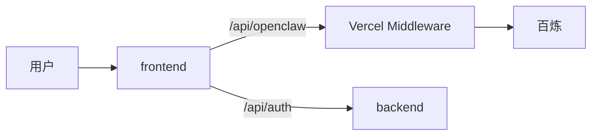

# QingLu 轻鹭

> AI 本地生活减脂管家：React 前端 + Express 账户后端 + 百炼 OpenClaw 对话。

仓库：[ShuoMeng66/QingLu](https://github.com/ShuoMeng66/QingLu)

## 概览

轻鹭把 OpenClaw Skill 与百炼接到外卖、聚餐、训练、恢复与一起动等场景。用户先自建减脂档案，再在对话中获得推荐；每次请求由前端路由选定一个 Skill 模块注入 system prompt，经 Vercel 代理访问百炼。



## 功能

- 用户自建档案 → `/ready` 反馈 → `/chat` 今日管家与五类任务
- OpenClaw 四模块 Skill + 北京/上海场景数据
- 意图路由后按模块注入 Skill，节省 token
- 门店卡片、输出守门、门面检索、账户与云同步

## 技术栈

React 19 · Vite · Express · SQLite · 百炼 DeepSeek/Qwen · Vercel · Render

## 快速开始

```powershell
.\scripts\start.ps1
```

或 `npm run install:all` 后 `npm run dev`。前端配置见 `frontend/.env.example`（百炼 Key）；后端见 `backend/.env.example`。

## 部署

**Vercel**（仓库根目录 Import，Framework: Other）

```text
OPENCLAW_TOKEN = <百炼 API Key>
OPENCLAW_PROXY_TARGET = https://dashscope.aliyuncs.com
OPENCLAW_PROXY_PATH = /compatible-mode
VITE_OPENCLAW_BASE_URL = /api/openclaw/v1
VITE_OPENCLAW_AGENT = deepseek-v4-flash
VITE_GUARD_AGENT = deepseek-v4-flash
BACKEND_URL = <Render 后端 URL>
RESEND_API_KEY = <可选>
QINGLU_PROXY_SECRET = <与 Render 相同，可选>
RESEND_FROM = QingLu <onboarding@resend.dev>
```

勿在生产配置 `VITE_OPENCLAW_TOKEN`。

**Render**（Root Directory: `backend`）

```text
JWT_SECRET = <随机字符串>
QINGLU_PROXY_SECRET = <与 Vercel 相同>
RESEND_API_KEY = <可选>
RESEND_FROM = QingLu <onboarding@resend.dev>
```

自检：`/api/openclaw/health`、`/api/auth/health`。

## 结构

`frontend/` · `backend/` · `Agent/burnpal_skill/` · `api/` · `lib/` · `vercel.json`

子文档：[`frontend/README.md`](frontend/README.md) · [`backend/README.md`](backend/README.md) · [`Agent/README.md`](Agent/README.md)
