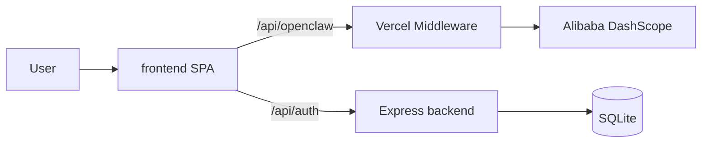

# QingLu Architecture

QingLu (轻鹭) is an AI wellness coach for local life scenarios: takeout, dining out, training, recovery, and social activities.

## High-level flow

## Frontend

- **React 19 + Vite** SPA in `frontend/`
- Skill modules bundled from `Agent/burnpal_skill/` into `frontend/src/generated/`
- Intent routing selects one skill module per turn to save tokens
- Optional **Output Guard**: pre-display review using a fast model (user-toggle in Settings, off by default)

## Backend

- **Express + SQLite** in `backend/` for auth, profile sync, and user data
- Deployed separately on Render; proxied from Vercel via `BACKEND_URL`

## Agent / Skills

- `Agent/burnpal_skill/` — four OpenClaw skill modules with Beijing/Shanghai venue data
- Vendored from [burnpal.skill](https://github.com/CCLYX/burnpal.skill); see root README Third-party section

## Deployment

- **Vercel**: hosts frontend build + edge/serverless API proxies (`vercel.json`, `middleware.ts`, `api/`)
- **Render**: hosts backend API

See [README](../README.md) for env variable checklist.

## Related docs

- [PE.md](../PE.md) — system prompt engineering notes
- [docs/hackathon.md](./hackathon.md) — original hackathon context (historical)
